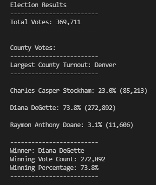

# Election_Analysis
### Overview
The purpose of this analysis was to investigate voter turnouts for specific counties and seeing which county had the highest turnout. This is in addition to also seeing who is the winner of the election
### Election-Audit- Results
- How many votes were cast in this congressional election?
  There were a total of 369,711 votes cast in this congressional election.
- Provide a breakdown of the number of votes and the percentage of total votes for each county in the precinct.
  The breakdown of votes for each county follows. Jefferson county had 38,855 votes, 10.5% of the vote. Denver county had 306,055 votes, 82.8% of the vote. Arapahoe county had 24,801 votes, 6.7% of the vote.
- Which county had the largest number of votes?
  Denver county had the largest number of votes and percentage by an enormous margin.
- Provide a breakdown of the number of votes and the percentage of the total votes each candidate received.
  The vote breakdown for each candidate follows. Charles Casper Stockham had 85,213 votes, 23% of the vote. Diana DeGette had 272,892 votes, 73.8% of the vote. Raymon Anthony Doane had 11,606 votes, 3.1% of the vote.
- Which candidate won the election, what was their vote count, and what was their percentage of the total votes?
Diana DeGette won the election with 272,892 votes which was 73.8% of the total votes.

Supporting image follows:

### Election-Audit Summary
This code can be used in a variety of elections with very little change. One proposal could be in school board elections with the only changes needed would be to the variable names to the candidates and the cities within the county. Another proposal would be for proposed amendment changes to the state's Constitution or votes on local laws. This would be simple as well. Instead of three possible choices there would only need to be two options, yes and no, for the proposed change and an expansion of the counties. I'll add a third as I think it would be the most interesting. By obtaining the voter data we could alter the code to look for demographics such as party. Another dictionary would need to be created for whatever we want to investigate (age, ethnicity, party affiliation, genderc etc.) but large amounts of the code could be copied. This way we could discover trends and all sort of information with the exit polling.
